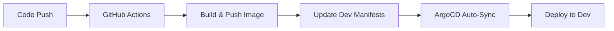
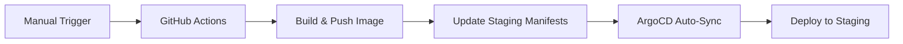
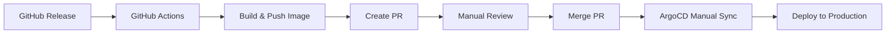

# GitHub Actions CI/CD Setup Guide

This repository includes GitHub Actions workflows for automated building, testing, and deployment of the Windows ASP.NET application to Azure Container Registry (ACR) and AKS via GitOps.

## 🔧 Setup Requirements

### 1. GitHub Secrets Configuration

You need to configure the following secrets in your GitHub repository:

#### Required Secrets

Navigate to **Settings** → **Secrets and variables** → **Actions** and add:

| Secret Name | Description | How to Get |
|-------------|-------------|------------|
| `ACR_USERNAME` | Azure Container Registry username | From ACR Access Keys |
| `ACR_PASSWORD` | Azure Container Registry password | From ACR Access Keys |

#### Getting ACR Credentials

```bash
# Method 1: Using Azure CLI
az acr credential show --name acrdemoeastus2001

# Method 2: Using Azure Portal
# 1. Navigate to your ACR (acrdemoeastus2001)
# 2. Go to Settings → Access keys
# 3. Enable "Admin user"
# 4. Copy Username and Password
```

#### Setting up GitHub Secrets

1. Go to your repository: `https://github.com/noumanmanan-msft/aks-gitops-demo`
2. Click **Settings** → **Secrets and variables** → **Actions**
3. Click **New repository secret**
4. Add each secret:
   - Name: `ACR_USERNAME`, Value: `acrdemoeastus2001`
   - Name: `ACR_PASSWORD`, Value: `<password-from-acr>`

### 2. GitHub Token Permissions

Ensure your repository has the following permissions enabled:

- **Settings** → **Actions** → **General**
- **Workflow permissions**: Choose "Read and write permissions"
- Check ✅ "Allow GitHub Actions to create and approve pull requests"

## 🚀 Workflows Overview

### 1. Build and Deploy (`build-and-deploy.yml`)

**Triggers:**
- Push to `main` or `develop` branches
- Changes in `aspnet-demo/` directory
- Pull requests to `main`

**What it does:**
- 🔨 Builds the .NET application
- 🧪 Runs tests (if any)
- 🐳 Builds Docker image with Windows containers
- 📤 Pushes to ACR with multiple tags:
  - `{git-sha}` - Specific commit
  - `latest` - Latest build
  - `v1.0.{run-number}` - Versioned (main branch only)
- 📝 Auto-updates development environment manifests
- 🔒 Security scanning (on PR)

### 2. Release and Deploy (`release-deploy.yml`)

**Triggers:**
- GitHub releases
- Manual workflow dispatch

**What it does:**
- 🏷️ Builds release-tagged images
- 📦 Updates staging/production environments
- 🔄 Creates PRs for production deployments (safety measure)
- 📢 Notifications on completion

### 3. PR Validation (`pr-validation.yml`)

**Triggers:**
- Pull requests

**What it does:**
- ✅ Validates build compilation
- 🧪 Runs tests
- 📋 Validates Kubernetes manifests
- 🔍 Security checks
- 📊 Provides validation summary

## 📋 Workflow Usage Examples

### Automatic Development Deployment

```bash
# 1. Make code changes
echo 'Updated message' > aspnet-demo/Controllers/HelloController.cs

# 2. Commit and push
git add .
git commit -m "Update hello message"
git push origin main

# 3. GitHub Actions will:
#    - Build and test the application
#    - Create Docker image
#    - Push to ACR
#    - Update development environment
#    - ArgoCD will auto-sync to development
```

### Manual Staging Deployment

```bash
# Option 1: Using GitHub UI
# 1. Go to Actions tab
# 2. Select "Release and Deploy"
# 3. Click "Run workflow"
# 4. Choose "staging" environment
# 5. Optionally specify image tag

# Option 2: Using GitHub CLI
gh workflow run release-deploy.yml -f environment=staging
```

### Production Release Process

```bash
# 1. Create a GitHub release
git tag v1.2.0
git push origin v1.2.0

# 2. Create release in GitHub UI or CLI
gh release create v1.2.0 --title "Release v1.2.0" --notes "Production release"

# 3. GitHub Actions will:
#    - Build release image tagged as v1.2.0
#    - Create PR for production deployment
#    - Require manual approval for production
```

## 🔄 GitOps Workflow

### Development Environment


### Staging Environment


### Production Environment


## 📊 Image Tagging Strategy

| Trigger | Tags Created | Usage |
|---------|--------------|-------|
| **Push to main** | `{sha}`, `latest`, `v1.0.{run}` | Development deployment |
| **Push to develop** | `{sha}`, `latest` | Feature testing |
| **GitHub Release** | `{release-tag}`, `latest` | Production releases |
| **Manual workflow** | `{sha}` or specified tag | Custom deployments |

## 🔍 Monitoring and Troubleshooting

### View Workflow Status
```bash
# Using GitHub CLI
gh run list --workflow=build-and-deploy.yml
gh run view {run-id}

# Check specific job logs
gh run view {run-id} --job=build-and-push
```

### Check ArgoCD Sync Status
```bash
# Get application status
kubectl get applications -n argocd

# Check specific application
argocd app get windows-aspnet-dev
argocd app sync windows-aspnet-dev --dry-run
```

### Verify Container Images
```bash
# List images in ACR
az acr repository show-tags --name acrdemoeastus2001 --repository windows-aspnet

# Pull and test image locally
docker pull acrdemoeastus2001.azurecr.io/windows-aspnet:latest
docker run -p 8080:80 acrdemoeastus2001.azurecr.io/windows-aspnet:latest
```

## 🛠️ Customization

### Adding Environment Variables

Edit `build-and-deploy.yml`:

```yaml
env:
  REGISTRY_NAME: acrdemoeastus2001  # Change this
  IMAGE_NAME: windows-aspnet        # Change this
  CUSTOM_VAR: value                 # Add custom vars
```

### Adding Build Steps

```yaml
- name: 'Custom build step'
  run: |
    # Add your custom commands here
    echo "Running custom build step"
```

### Modifying Auto-Update Behavior

To change which environments get auto-updated:

```yaml
# In build-and-deploy.yml, modify the update-manifests job
- name: 'Update development environment'
  run: |
    cd environments/development  # Change environment here
    kustomize edit set image ${{ env.REGISTRY_NAME }}.azurecr.io/${{ env.IMAGE_NAME }}:${{ github.sha }}
```

## 🔒 Security Best Practices

### 1. Secret Management
- ✅ Store ACR credentials in GitHub Secrets
- ✅ Use least-privilege access
- ✅ Rotate secrets regularly

### 2. Image Security
- ✅ Vulnerability scanning enabled
- ✅ Use specific base image versions
- ✅ Regular base image updates

### 3. Workflow Security
- ✅ Restricted workflow permissions
- ✅ PR approval required for production
- ✅ Audit trail via Git commits

## 📞 Support and Troubleshooting

### Common Issues

#### 1. **ACR Authentication Failed**
```
Error: unauthorized: authentication required
```
**Solution:** Check ACR_USERNAME and ACR_PASSWORD secrets

#### 2. **Docker Build Failed on Windows**
```
Error: Windows container feature not available
```
**Solution:** Workflow uses `runs-on: windows-latest` for Windows containers

#### 3. **Kustomize Not Found**
```
Error: kustomize: command not found
```
**Solution:** Kustomize installation step included in workflow

#### 4. **ArgoCD Not Syncing**
- Check application health in ArgoCD UI
- Verify repository access
- Check for sync policy configuration

### Getting Help

1. **Check workflow logs** in GitHub Actions tab
2. **Monitor ArgoCD UI** at https://172.193.108.166
3. **Review application logs** with kubectl
4. **Check this documentation** for configuration details

---

**Happy CI/CD! 🚀**