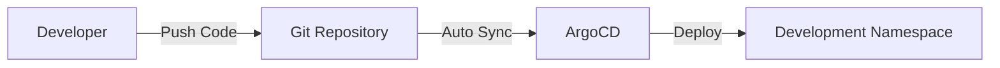

# GitOps with ArgoCD Setup Guide

This guide explains how to set up GitOps for the Windows ASP.NET application using ArgoCD on AKS.

## Architecture Overview

```
┌─────────────────┐    ┌──────────────────┐    ┌─────────────────────┐
│   Git Repository│    │     ArgoCD       │    │    AKS Cluster      │
│                 │    │                  │    │                     │
│  ├─ environments│───▶│  ├─ Applications │───▶│  ├─ development     │
│     ├─ dev      │    │     ├─ dev-app   │    │     ├─ staging       │
│     ├─ staging  │    │     ├─ stg-app   │    │     ├─ production    │
│     └─ prod     │    │     └─ prd-app   │    │     └─ argocd        │
│                 │    │                  │    │                     │
└─────────────────┘    └──────────────────┘    └─────────────────────┘
```

## Directory Structure

```
aks-gitops-demo/
├── argocd/                          # ArgoCD configurations
│   ├── install-argocd.ps1          # ArgoCD installation script
│   ├── deploy-applications.ps1      # Deploy ArgoCD applications
│   ├── project.yaml                # ArgoCD project configuration
│   └── applications/               # Application manifests
│       ├── windows-aspnet-dev.yaml
│       ├── windows-aspnet-staging.yaml
│       └── windows-aspnet-production.yaml
├── environments/                   # Environment-specific configurations
│   ├── development/               # Dev environment
│   │   ├── kustomization.yaml
│   │   ├── namespace.yaml
│   │   ├── deployment.yaml
│   │   └── service.yaml
│   ├── staging/                   # Staging environment
│   │   ├── kustomization.yaml
│   │   ├── namespace.yaml
│   │   ├── deployment.yaml
│   │   ├── service.yaml
│   │   └── hpa.yaml
│   └── production/               # Production environment
│       ├── kustomization.yaml
│       ├── namespace.yaml
│       ├── deployment.yaml
│       ├── service.yaml
│       ├── hpa.yaml
│       └── pdb.yaml
└── aspnet-demo/                  # Application source code
```

## Environment Configurations

### Development Environment
- **Namespace**: `development`
- **Replicas**: 2
- **Resources**: Lower limits (256Mi memory, 100m CPU)
- **Service**: ClusterIP (internal access only)
- **Sync**: Automated with self-heal enabled

### Staging Environment
- **Namespace**: `staging`
- **Replicas**: 3
- **Resources**: Medium limits (512Mi memory, 250m CPU)
- **Service**: LoadBalancer (external access)
- **HPA**: 2-8 replicas based on CPU/memory
- **Sync**: Automated without self-heal (manual approval for changes)

### Production Environment
- **Namespace**: `production`
- **Replicas**: 5
- **Resources**: High limits (1Gi memory, 500m CPU)
- **Service**: LoadBalancer (external access)
- **HPA**: 3-15 replicas based on CPU/memory
- **PDB**: Minimum 2 pods available during updates
- **Sync**: Manual only (no automated deployment)

## Installation and Setup

### Step 1: Install ArgoCD

```powershell
# Navigate to the project directory
cd C:\Users\noumanmanan\OneDrive - Microsoft\Documents\Repos\Microsoft\FSI\Customers\TokioMarine\aks-gitops-demo

# Install ArgoCD
.\argocd\install-argocd.ps1
```

### Step 2: Push Code to Git Repository

```powershell
# Initialize git repository (if not already done)
git init
git add .
git commit -m "Initial GitOps setup with ArgoCD"

# Add remote repository (replace with your repo URL)
git remote add origin https://github.com/noumanmanan-msft/aks-gitops-demo.git
git push -u origin main
```

### Step 3: Update Repository URLs

Update the `repoURL` in the ArgoCD application manifests:
- `argocd/applications/windows-aspnet-dev.yaml`
- `argocd/applications/windows-aspnet-staging.yaml`
- `argocd/applications/windows-aspnet-production.yaml`
- `argocd/project.yaml`

Replace `https://github.com/noumanmanan-msft/aks-gitops-demo` with your actual repository URL.

### Step 4: Deploy ArgoCD Applications

```powershell
# Deploy all applications
.\argocd\deploy-applications.ps1 -RepoURL "https://github.com/noumanmanan-msft/aks-gitops-demo"
```

## ArgoCD Access

### Web UI Access
```powershell
# Get ArgoCD server external IP
kubectl get service argocd-server -n argocd

# Access at: https://<EXTERNAL-IP>
# Username: admin
# Password: (from installation output)
```

### CLI Access
```bash
# Install ArgoCD CLI
# Windows: Download from https://github.com/argoproj/argo-cd/releases
# Or use chocolatey: choco install argocd-cli

# Login to ArgoCD
argocd login <ARGOCD-SERVER-IP> --username admin --password <PASSWORD> --insecure

# List applications
argocd app list

# Get application details
argocd app get windows-aspnet-dev

# Sync application
argocd app sync windows-aspnet-dev
```

## GitOps Workflow

### 1. Development Workflow


### 2. Staging Workflow


### 3. Production Workflow


## Managing Applications

### Sync Applications
```bash
# Sync development (auto-sync enabled)
argocd app sync windows-aspnet-dev

# Sync staging (manual approval)
argocd app sync windows-aspnet-staging

# Sync production (manual only)
argocd app sync windows-aspnet-production
```

### Update Image Tags
```bash
# Update development image tag
cd environments/development
kustomize edit set image acrdemoeastus2001.azurecr.io/windows-aspnet:v1.1
git add . && git commit -m "Update dev image to v1.1" && git push
```

### Monitor Applications
```bash
# Watch application status
kubectl get applications -n argocd -w

# Get application sync status
argocd app get windows-aspnet-production --refresh

# View application history
argocd app history windows-aspnet-production
```

## Troubleshooting

### Application Not Syncing
```bash
# Check application status
argocd app get <app-name>

# Check ArgoCD logs
kubectl logs -n argocd deployment/argocd-application-controller

# Manual refresh
argocd app get <app-name> --refresh
```

### Sync Failures
```bash
# View sync details
argocd app get <app-name> --show-operation

# Check resource differences
argocd app diff <app-name>

# Force sync (override)
argocd app sync <app-name> --force
```

### Repository Access Issues
```bash
# Check repository credentials
kubectl get secret -n argocd

# Update repository credentials
kubectl create secret generic repo-secret \
  --from-literal=type=git \
  --from-literal=url=https://github.com/noumanmanan-msft/aks-gitops-demo \
  --from-literal=password=<TOKEN> \
  --from-literal=username=<USERNAME> \
  -n argocd
```

## Best Practices

### 1. Branch Strategy
- **main**: Production-ready code
- **develop**: Development branch
- **feature/***: Feature branches
- Use pull requests for all changes

### 2. Image Tagging
- Use semantic versioning (v1.0.0)
- Avoid `latest` tag in production
- Tag images with git commit SHA for traceability

### 3. Environment Promotion
```bash
# 1. Deploy to development (auto)
git push origin develop

# 2. Promote to staging (manual)
git checkout main
git merge develop
git tag v1.1.0
git push origin main --tags

# 3. Update staging image tag
cd environments/staging
kustomize edit set image acrdemoeastus2001.azurecr.io/windows-aspnet:v1.1.0

# 4. Manual sync to production after validation
```

### 4. Security
- Use least-privilege RBAC
- Store secrets in Azure Key Vault
- Enable ArgoCD RBAC
- Use private repositories

### 5. Monitoring
- Monitor ArgoCD application health
- Set up alerts for sync failures  
- Use ArgoCD notifications
- Monitor application metrics

## Advanced Features

### 1. Progressive Delivery with Argo Rollouts
```yaml
apiVersion: argoproj.io/v1alpha1
kind: Rollout
metadata:
  name: windows-aspnet-rollout
spec:
  strategy:
    canary:
      steps:
      - setWeight: 20
      - pause: {duration: 10m}
      - setWeight: 50
      - pause: {duration: 10m}
```

### 2. Multi-Cluster Deployment
```yaml
apiVersion: argoproj.io/v1alpha1
kind: Application
spec:
  destination:
    server: https://cluster2.example.com
    namespace: production
```

### 3. Application Sets for Multiple Environments
```yaml
apiVersion: argoproj.io/v1alpha1
kind: ApplicationSet
metadata:
  name: windows-aspnet-environments
spec:
  generators:
  - list:
      elements:
      - environment: development
        replicas: 2
      - environment: staging
        replicas: 3
      - environment: production
        replicas: 5
```

This GitOps setup provides a robust, scalable, and secure deployment pipeline for your Windows ASP.NET application on AKS.